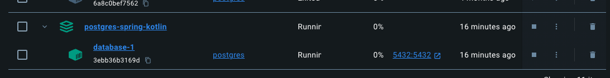

# PostgreSQL Database Docker Env
使用此設置來啟動 PostgreSQL DB 的執行環境

### 啟動環境
docker compose up
```
.env中可以設置docker container的名稱
docker-compose.yml裡有database名稱與登入帳戶與密碼，可自行設置
```
執行成功後，應可看到正在執行的container實體


### 啟動成功後
可執行 ./sql/create-table-and-data.sql 來產生範例table與資料