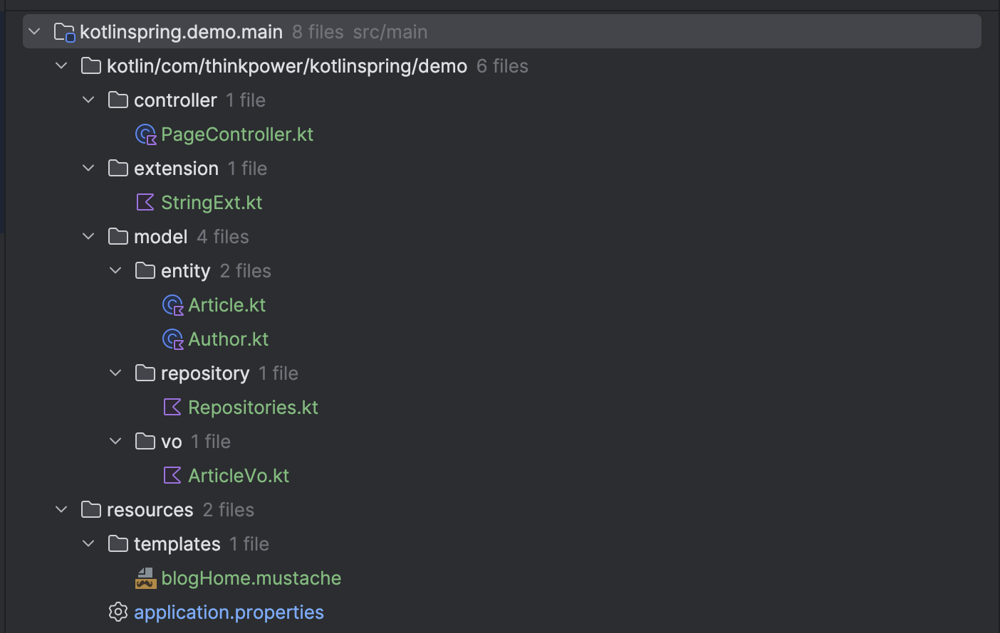
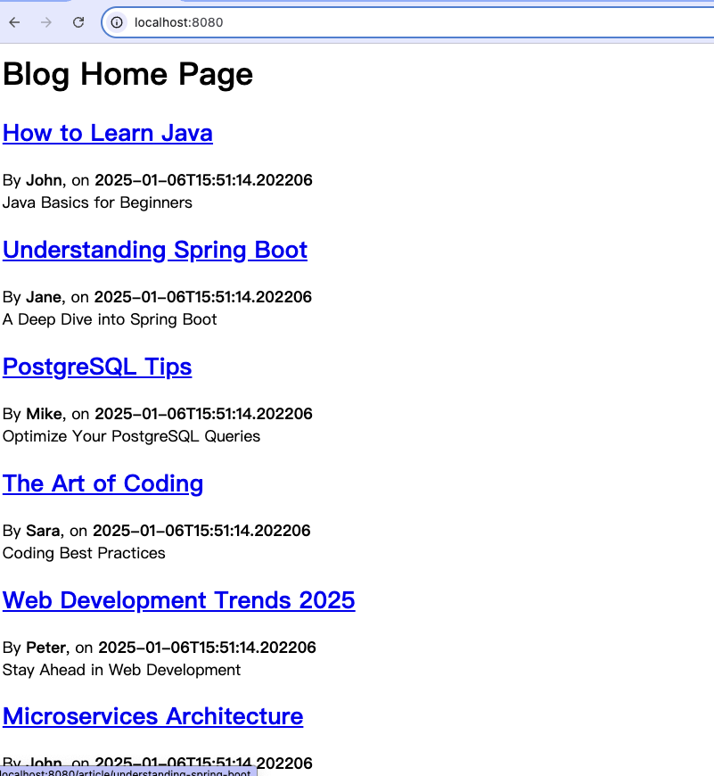

# 執行基本Spring Web App並由Web端看資料庫資料

新增程式碼如圖所示

## 執行成功後
進入 http://localhost:8080
應可看到網頁執行結果


## 程式碼表列如下
* PageController.kt
```kotlin
@Controller
class PageController(private val repository: ArticleRepository) {

    @GetMapping("/")
    fun blog(model: Model): String {
        model["title"] = "This is Blog Title"

        model["articles"] = repository.findAllByOrderByAddedAtDesc().map { it.toVo() }
        model["content"] = true
        return "blogHome"
    }
}
```

* StringExt.kt
```kotlin
fun String.toSlug() = lowercase(Locale.getDefault())
    .replace("\n", " ")
    .replace("[^a-z\\d\\s]".toRegex(), " ")
    .split(" ")
    .joinToString("-")
    .replace("-+".toRegex(), "-")
```

* Article.kt Entity
```kotlin
@Entity
class Article (
    @Id @GeneratedValue var id: Long? = null,
    var title: String,
    var headline: String,
    var content: String,
    @ManyToOne var author: Author,
    var slug: String = title.toSlug(),
    var addedAt: LocalDateTime = LocalDateTime.now(),
)
```

* Author.kt Entity
```kotlin
@Entity
class Author(
    @Id @GeneratedValue var id: Long? = null,
    @Column(unique = true, nullable = false) var login: String,
    var firstname: String,
    var lastname: String,
    var description: String? = null,
)
```

* All repository - Repositories.kt
```kotlin
interface ArticleRepository : CrudRepository<Article, Long> {
    fun findBySlug(slug: String): Article?
    fun findAllByOrderByAddedAtDesc(): Iterable<Article>
}

interface UserRepository : CrudRepository<Author, Long> {
    fun findByLogin(login: String): Author?
}
```

* ArticleVo.kt
```kotlin
fun Article.toVo() = ArticleVo(
    slug,
    title,
    headline,
    content,
    author,
    addedAt.toString()
)

data class ArticleVo(
    val slug: String,
    val title: String,
    val headline: String,
    val content: String,
    val author: Author,
    val addedAt: String)
```

* blogHome.mustache
```html

<h1>Blog Home Page</h1>
<div class="articles">
    {{#articles}}
        <section>
            <header class="article-header">
                <h2 class="article-title"><a href="/article/{{slug}}">{{title}}</a></h2>
                <div class="article-meta">By  <strong>{{author.firstname}}</strong>, on <strong>{{addedAt}}</strong></div>
            </header>
            <div class="article-description">
                {{headline}}
            </div>
        </section>
    {{/articles}}
</div>
```

* application.properties
```properties
spring.application.name=kotlinspring.demo

# DB Setting
spring.datasource.url=jdbc:postgresql://localhost:5432/kotlin_spring_demo
spring.datasource.username=oster
spring.datasource.password=oster_pwd
spring.datasource.driver-class-name=org.postgresql.Driver
# JPA with postgreSQL
spring.jpa.database-platform=org.hibernate.dialect.PostgreSQLDialect
spring.jpa.hibernate.ddl-auto=update
```